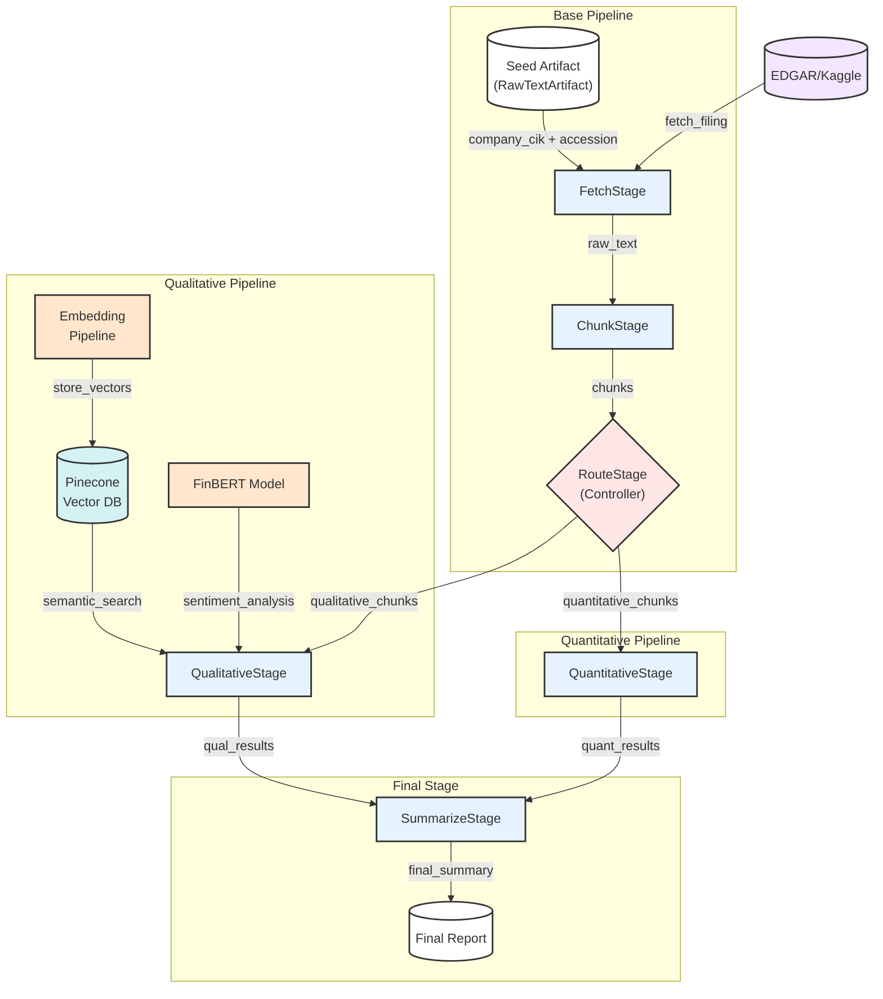

# 10-K Form Agent Workflow

## System Architecture Diagram

## Component Details

### Base Pipeline
- **Seed Artifact**: Input container with company information
- **FetchStage**: Retrieves 10-K filing text from EDGAR/Kaggle
- **ChunkStage**: Splits text into manageable chunks
- **RouteStage**: Routes chunks to appropriate analysis pipeline

### Qualitative Pipeline
- **QualitativeStage**: Analyzes qualitative factors using FinBERT and RAG
- **Pinecone Vector DB**: Vector storage for semantic search
- **FinBERT Model**: Pre-trained financial sentiment model
- **Embedding Pipeline**: Sentence transformer embeddings

### Quantitative Pipeline
- **QuantitativeStage**: Analyzes quantitative metrics and ratios

### Final Stage
- **SummarizeStage**: Combines analyses into final report
- **Final Report**: Dictionary output with comprehensive analysis

## Data Flow

1. Process begins with empty RawTextArtifact containing company info
2. FetchStage retrieves filing text using provided company CIK and accession
3. ChunkStage splits text into manageable segments
4. RouteStage determines appropriate pipeline for each chunk
5. Parallel processing:
   - Qualitative: Semantic search and sentiment analysis
   - Quantitative: Financial metrics extraction
6. Results combined in SummarizeStage
7. Final Report generated with complete analysis